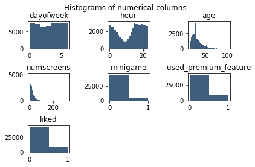
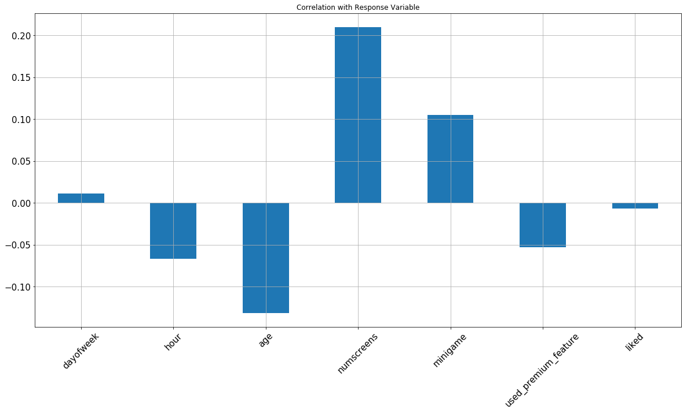
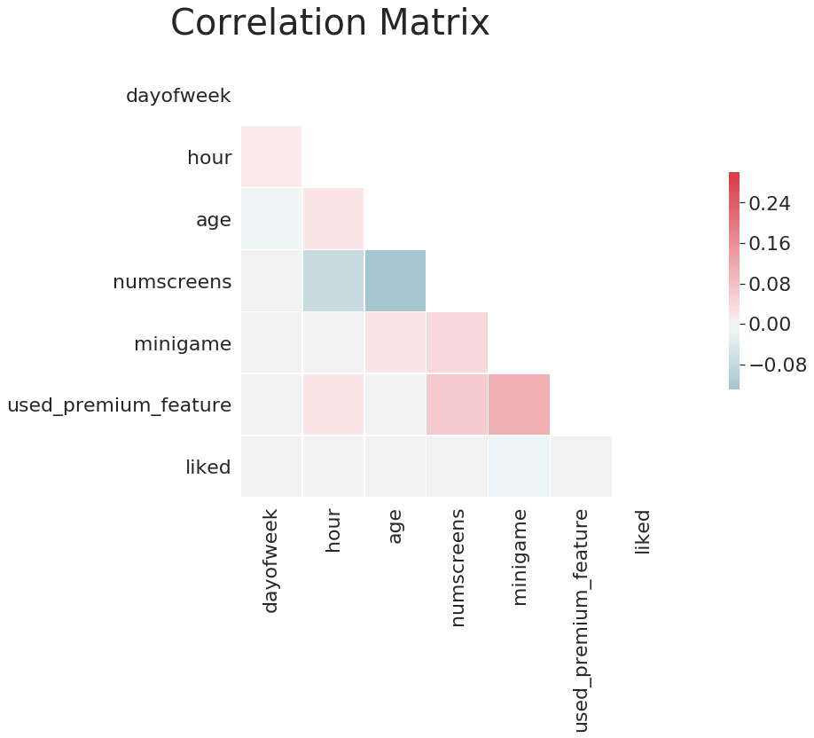
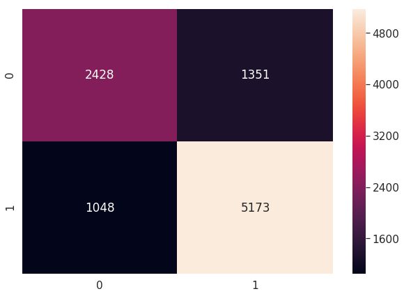

# Case Study Fintech Company

- The company wants to give paid subscripton to its customers which will allow to track their finances in one place.
- To attract customers the company has released a free version of the app with some main features unlocked.
- Our task is to indentify customers who will NOT enroll in the paid products so additional offers can be made to them

## DATA

- We have access to the data of customers behaviour with the app. 
- This data include Date-Time installation of the application, features that customer engaged within the app. 
- The App behaviour is charecterized as the list of app screens customer looked at and whether they engaged in the min-financial games available within the app
- The company allows only a 24 hour trial to the customer and then provides the user with offers for the premium version of the app.

## Dataset
- Our Dataset consists of :
    - user : The ID of the user
    - first_open : When the app was first opened
    - dayofweek : The day of the week 0 being Sunday and 6 being Satuday
    - age : Age of the user
    - screen_list : list of screens accesed by the user
    - numscreens : Number of screens the user has seen
    - minigame : Whether the minigame is played by the user
    - liked : Different pages of the app contains like feature and how many times the user used it.
    - used_premium_feature : A user has used the premium feature or not.
    - enrolled : User enrolled to the paid product.
    - enrolled_date : Date and Time when user enrolled to the paid product
    
### Importing Required Iibraries to start the EDA process    


```python
import numpy as np
import pandas as pd
import matplotlib.pyplot as plt
import seaborn as sn
from dateutil import parser
```


```python
dataset = pd.read_csv('appdata10.csv')
```


```python
dataset.describe()
```


<div>
<style scoped>
    .dataframe tbody tr th:only-of-type {
        vertical-align: middle;
    }

    .dataframe tbody tr th {
        vertical-align: top;
    }

    .dataframe thead th {
        text-align: right;
    }
</style>
<table border="1" class="dataframe">
  <thead>
    <tr style="text-align: right;">
      <th></th>
      <th>user</th>
      <th>dayofweek</th>
      <th>age</th>
      <th>numscreens</th>
      <th>minigame</th>
      <th>used_premium_feature</th>
      <th>enrolled</th>
      <th>liked</th>
    </tr>
  </thead>
  <tbody>
    <tr>
      <th>count</th>
      <td>50000.000000</td>
      <td>50000.000000</td>
      <td>50000.00000</td>
      <td>50000.000000</td>
      <td>50000.000000</td>
      <td>50000.000000</td>
      <td>50000.000000</td>
      <td>50000.000000</td>
    </tr>
    <tr>
      <th>mean</th>
      <td>186889.729900</td>
      <td>3.029860</td>
      <td>31.72436</td>
      <td>21.095900</td>
      <td>0.107820</td>
      <td>0.172020</td>
      <td>0.621480</td>
      <td>0.165000</td>
    </tr>
    <tr>
      <th>std</th>
      <td>107768.520361</td>
      <td>2.031997</td>
      <td>10.80331</td>
      <td>15.728812</td>
      <td>0.310156</td>
      <td>0.377402</td>
      <td>0.485023</td>
      <td>0.371184</td>
    </tr>
    <tr>
      <th>min</th>
      <td>13.000000</td>
      <td>0.000000</td>
      <td>16.00000</td>
      <td>1.000000</td>
      <td>0.000000</td>
      <td>0.000000</td>
      <td>0.000000</td>
      <td>0.000000</td>
    </tr>
    <tr>
      <th>25%</th>
      <td>93526.750000</td>
      <td>1.000000</td>
      <td>24.00000</td>
      <td>10.000000</td>
      <td>0.000000</td>
      <td>0.000000</td>
      <td>0.000000</td>
      <td>0.000000</td>
    </tr>
    <tr>
      <th>50%</th>
      <td>187193.500000</td>
      <td>3.000000</td>
      <td>29.00000</td>
      <td>18.000000</td>
      <td>0.000000</td>
      <td>0.000000</td>
      <td>1.000000</td>
      <td>0.000000</td>
    </tr>
    <tr>
      <th>75%</th>
      <td>279984.250000</td>
      <td>5.000000</td>
      <td>37.00000</td>
      <td>28.000000</td>
      <td>0.000000</td>
      <td>0.000000</td>
      <td>1.000000</td>
      <td>0.000000</td>
    </tr>
    <tr>
      <th>max</th>
      <td>373662.000000</td>
      <td>6.000000</td>
      <td>101.00000</td>
      <td>325.000000</td>
      <td>1.000000</td>
      <td>1.000000</td>
      <td>1.000000</td>
      <td>1.000000</td>
    </tr>
  </tbody>
</table>
</div>


Coverting our hour column in dataset to an int type


```python
dataset['hour'] = dataset.hour.str.slice(1,3).astype(int)
```

Cerating a temporary dataset with columns we don't want


```python
dataset2 = dataset.copy().drop(columns = ['user', 'screen_list', 'enrolled_date', 'first_open', 'enrolled'])
```


```python
dataset2.head()
```


<div>
<style scoped>
    .dataframe tbody tr th:only-of-type {
        vertical-align: middle;
    }

    .dataframe tbody tr th {
        vertical-align: top;
    }

    .dataframe thead th {
        text-align: right;
    }
</style>
<table border="1" class="dataframe">
  <thead>
    <tr style="text-align: right;">
      <th></th>
      <th>dayofweek</th>
      <th>hour</th>
      <th>age</th>
      <th>numscreens</th>
      <th>minigame</th>
      <th>used_premium_feature</th>
      <th>liked</th>
    </tr>
  </thead>
  <tbody>
    <tr>
      <th>0</th>
      <td>3</td>
      <td>2</td>
      <td>23</td>
      <td>15</td>
      <td>0</td>
      <td>0</td>
      <td>0</td>
    </tr>
    <tr>
      <th>1</th>
      <td>6</td>
      <td>1</td>
      <td>24</td>
      <td>13</td>
      <td>0</td>
      <td>0</td>
      <td>0</td>
    </tr>
    <tr>
      <th>2</th>
      <td>1</td>
      <td>19</td>
      <td>23</td>
      <td>3</td>
      <td>0</td>
      <td>1</td>
      <td>1</td>
    </tr>
    <tr>
      <th>3</th>
      <td>4</td>
      <td>16</td>
      <td>28</td>
      <td>40</td>
      <td>0</td>
      <td>0</td>
      <td>0</td>
    </tr>
    <tr>
      <th>4</th>
      <td>1</td>
      <td>18</td>
      <td>31</td>
      <td>32</td>
      <td>0</td>
      <td>0</td>
      <td>1</td>
    </tr>
  </tbody>
</table>
</div>


Plotting histograms to get better insights of our dataset


```python
plt.suptitle('Histograms of numerical columns', fontsize = 12)
for i in range (1, dataset2.shape[1] + 1):
    plt.subplot(3,3,i)
    f = plt.gca()
    f.set_title(dataset2.columns.values[i-1])
    vals = np.size(dataset2.iloc[:, i -1 ].unique())
    plt.hist(dataset2.iloc[:, i- 1], bins = vals, color = "#3F5D7D")
    plt.subplots_adjust(hspace= 0.9, wspace= 0.9)
```





- Now the we have plotted our dataset we'll convert out insights into correlation by using correlation plots
- We do this in order to find out which of our attributes are important and at what magnitude they affect out final outcome i.e the users enrolled for premium version 


```python
dataset2.corrwith(dataset.enrolled).plot.bar(figsize = (20,10),
                                             title = 'Correlation with Response Variable',
                                             fontsize = 15, rot = 45,
                                             grid = True)
```


    <matplotlib.axes._subplots.AxesSubplot at 0x1a2060bbe0>





### Making vague conslusions from our correlation plot
- dayofweek is positively related i.e later the day of the week more likely to enroll
- hour is neagtively related i.e earlier in the day more likely to enroll
- age is negatively related i.e more young the user is more likely to enroll
- numscreens is positvely related i.e more screens visited more likely to enroll
- minigame is positvely related i.e user who played minigame is more likely to enroll
- used_premium_feature is negatively related i.e user who used premium feature is unlikely to enroll

### Now before Model Building We'll build a correlation matrix


```python
sn.set(style='white', font_scale=2)

# Compute the correlation matrix
corr = dataset2.corr()

# Generate the mask for upper traingle
mask = np.zeros_like(corr,dtype=bool)
mask[np.triu_indices_from(mask)] = True

# Setup the matplotlib Figure
f ,ax = plt.subplots(figsize = (22,9))
f.suptitle('Correlation Matrix', fontsize = 40)

# Generate a Custome dividing colormap
cmap = sn.diverging_palette(220, 10, as_cmap=True)

#Draw heatmap with mask and correct aspect ratio
sn.heatmap(corr, mask=mask, cmap=cmap, vmax=0.3 , center=0, square=True, linewidths=0.5, cbar_kws={"shrink" : 0.5})
```


    <matplotlib.axes._subplots.AxesSubplot at 0x1a224ed080>





### Now we'll format the listed screens 
- We have a csv that gives us the list of screens that are used more frequently
- We'll format the screen_list using this csv file


```python
top_screens = pd.read_csv('top_screens.csv').top_screens.values
```


```python
top_screens
```


    array(['Loan2', 'location', 'Institutions', 'Credit3Container',
           'VerifyPhone', 'BankVerification', 'VerifyDateOfBirth',
           'ProfilePage', 'VerifyCountry', 'Cycle', 'idscreen',
           'Credit3Dashboard', 'Loan3', 'CC1Category', 'Splash', 'Loan',
           'CC1', 'RewardsContainer', 'Credit3', 'Credit1', 'EditProfile',
           'Credit2', 'Finances', 'CC3', 'Saving9', 'Saving1', 'Alerts',
           'Saving8', 'Saving10', 'Leaderboard', 'Saving4', 'VerifyMobile',
           'VerifyHousing', 'RewardDetail', 'VerifyHousingAmount',
           'ProfileMaritalStatus', 'ProfileChildren ', 'ProfileEducation',
           'Saving7', 'ProfileEducationMajor', 'Rewards', 'AccountView',
           'VerifyAnnualIncome', 'VerifyIncomeType', 'Saving2', 'Saving6',
           'Saving2Amount', 'Saving5', 'ProfileJobTitle', 'Login',
           'ProfileEmploymentLength', 'WebView', 'SecurityModal', 'Loan4',
           'ResendToken', 'TransactionList', 'NetworkFailure', 'ListPicker'],
          dtype=object)


```python
dataset['screen_list'] = dataset.screen_list.astype(str) + ','
```


```python
for sc in top_screens:
    dataset[sc] = dataset.screen_list.str.contains(sc).astype(int)
    dataset['screen_list'] = dataset.screen_list.str.replace(sc+",","")
    
```


```python
dataset['Other'] = dataset.screen_list.str.count(",")
dataset.drop(columns=['screen_list'])
```


<div>
<style scoped>
    .dataframe tbody tr th:only-of-type {
        vertical-align: middle;
    }

    .dataframe tbody tr th {
        vertical-align: top;
    }

    .dataframe thead th {
        text-align: right;
    }
</style>
<table border="1" class="dataframe">
  <thead>
    <tr style="text-align: right;">
      <th></th>
      <th>user</th>
      <th>first_open</th>
      <th>dayofweek</th>
      <th>hour</th>
      <th>age</th>
      <th>numscreens</th>
      <th>minigame</th>
      <th>used_premium_feature</th>
      <th>enrolled</th>
      <th>enrolled_date</th>
      <th>...</th>
      <th>Login</th>
      <th>ProfileEmploymentLength</th>
      <th>WebView</th>
      <th>SecurityModal</th>
      <th>Loan4</th>
      <th>ResendToken</th>
      <th>TransactionList</th>
      <th>NetworkFailure</th>
      <th>ListPicker</th>
      <th>Other</th>
    </tr>
  </thead>
  <tbody>
    <tr>
      <th>0</th>
      <td>235136</td>
      <td>2012-12-27 02:14:51.273</td>
      <td>3</td>
      <td>2</td>
      <td>23</td>
      <td>15</td>
      <td>0</td>
      <td>0</td>
      <td>0</td>
      <td>NaN</td>
      <td>...</td>
      <td>1</td>
      <td>0</td>
      <td>0</td>
      <td>0</td>
      <td>0</td>
      <td>0</td>
      <td>0</td>
      <td>0</td>
      <td>0</td>
      <td>7</td>
    </tr>
    <tr>
      <th>1</th>
      <td>333588</td>
      <td>2012-12-02 01:16:00.905</td>
      <td>6</td>
      <td>1</td>
      <td>24</td>
      <td>13</td>
      <td>0</td>
      <td>0</td>
      <td>0</td>
      <td>NaN</td>
      <td>...</td>
      <td>0</td>
      <td>0</td>
      <td>0</td>
      <td>0</td>
      <td>0</td>
      <td>0</td>
      <td>0</td>
      <td>0</td>
      <td>0</td>
      <td>5</td>
    </tr>
    <tr>
      <th>2</th>
      <td>254414</td>
      <td>2013-03-19 19:19:09.157</td>
      <td>1</td>
      <td>19</td>
      <td>23</td>
      <td>3</td>
      <td>0</td>
      <td>1</td>
      <td>0</td>
      <td>NaN</td>
      <td>...</td>
      <td>0</td>
      <td>0</td>
      <td>0</td>
      <td>0</td>
      <td>0</td>
      <td>0</td>
      <td>0</td>
      <td>0</td>
      <td>0</td>
      <td>0</td>
    </tr>
    <tr>
      <th>3</th>
      <td>234192</td>
      <td>2013-07-05 16:08:46.354</td>
      <td>4</td>
      <td>16</td>
      <td>28</td>
      <td>40</td>
      <td>0</td>
      <td>0</td>
      <td>1</td>
      <td>2013-07-05 16:11:49.513</td>
      <td>...</td>
      <td>0</td>
      <td>0</td>
      <td>0</td>
      <td>0</td>
      <td>0</td>
      <td>0</td>
      <td>0</td>
      <td>0</td>
      <td>0</td>
      <td>6</td>
    </tr>
    <tr>
      <th>4</th>
      <td>51549</td>
      <td>2013-02-26 18:50:48.661</td>
      <td>1</td>
      <td>18</td>
      <td>31</td>
      <td>32</td>
      <td>0</td>
      <td>0</td>
      <td>1</td>
      <td>2013-02-26 18:56:37.841</td>
      <td>...</td>
      <td>0</td>
      <td>0</td>
      <td>0</td>
      <td>0</td>
      <td>0</td>
      <td>0</td>
      <td>0</td>
      <td>0</td>
      <td>0</td>
      <td>10</td>
    </tr>
    <tr>
      <th>5</th>
      <td>56480</td>
      <td>2013-04-03 09:58:15.752</td>
      <td>2</td>
      <td>9</td>
      <td>20</td>
      <td>14</td>
      <td>0</td>
      <td>0</td>
      <td>1</td>
      <td>2013-04-03 09:59:03.291</td>
      <td>...</td>
      <td>0</td>
      <td>0</td>
      <td>0</td>
      <td>0</td>
      <td>0</td>
      <td>0</td>
      <td>0</td>
      <td>0</td>
      <td>0</td>
      <td>6</td>
    </tr>
    <tr>
      <th>6</th>
      <td>144649</td>
      <td>2012-12-25 02:33:18.461</td>
      <td>1</td>
      <td>2</td>
      <td>35</td>
      <td>3</td>
      <td>0</td>
      <td>0</td>
      <td>0</td>
      <td>NaN</td>
      <td>...</td>
      <td>0</td>
      <td>0</td>
      <td>0</td>
      <td>0</td>
      <td>0</td>
      <td>0</td>
      <td>0</td>
      <td>0</td>
      <td>0</td>
      <td>3</td>
    </tr>
    <tr>
      <th>7</th>
      <td>249366</td>
      <td>2012-12-11 03:07:49.875</td>
      <td>1</td>
      <td>3</td>
      <td>26</td>
      <td>41</td>
      <td>0</td>
      <td>1</td>
      <td>0</td>
      <td>NaN</td>
      <td>...</td>
      <td>0</td>
      <td>0</td>
      <td>0</td>
      <td>0</td>
      <td>0</td>
      <td>0</td>
      <td>1</td>
      <td>0</td>
      <td>0</td>
      <td>8</td>
    </tr>
    <tr>
      <th>8</th>
      <td>372004</td>
      <td>2013-03-20 14:22:01.569</td>
      <td>2</td>
      <td>14</td>
      <td>29</td>
      <td>33</td>
      <td>1</td>
      <td>1</td>
      <td>1</td>
      <td>2013-04-27 22:24:54.542</td>
      <td>...</td>
      <td>0</td>
      <td>0</td>
      <td>0</td>
      <td>0</td>
      <td>1</td>
      <td>0</td>
      <td>0</td>
      <td>0</td>
      <td>0</td>
      <td>19</td>
    </tr>
    <tr>
      <th>9</th>
      <td>338013</td>
      <td>2013-04-26 18:22:16.013</td>
      <td>4</td>
      <td>18</td>
      <td>26</td>
      <td>19</td>
      <td>0</td>
      <td>0</td>
      <td>1</td>
      <td>2013-04-26 18:31:58.923</td>
      <td>...</td>
      <td>0</td>
      <td>0</td>
      <td>0</td>
      <td>0</td>
      <td>0</td>
      <td>0</td>
      <td>0</td>
      <td>0</td>
      <td>0</td>
      <td>11</td>
    </tr>
    <tr>
      <th>10</th>
      <td>43555</td>
      <td>2013-05-14 04:48:27.597</td>
      <td>1</td>
      <td>4</td>
      <td>39</td>
      <td>14</td>
      <td>0</td>
      <td>0</td>
      <td>1</td>
      <td>2013-05-15 21:02:17.200</td>
      <td>...</td>
      <td>0</td>
      <td>0</td>
      <td>0</td>
      <td>0</td>
      <td>0</td>
      <td>0</td>
      <td>0</td>
      <td>0</td>
      <td>0</td>
      <td>4</td>
    </tr>
    <tr>
      <th>11</th>
      <td>317454</td>
      <td>2013-05-28 11:07:07.358</td>
      <td>1</td>
      <td>11</td>
      <td>32</td>
      <td>25</td>
      <td>1</td>
      <td>1</td>
      <td>0</td>
      <td>NaN</td>
      <td>...</td>
      <td>0</td>
      <td>0</td>
      <td>0</td>
      <td>0</td>
      <td>0</td>
      <td>0</td>
      <td>0</td>
      <td>0</td>
      <td>0</td>
      <td>8</td>
    </tr>
    <tr>
      <th>12</th>
      <td>205375</td>
      <td>2012-12-17 06:28:45.903</td>
      <td>0</td>
      <td>6</td>
      <td>25</td>
      <td>11</td>
      <td>0</td>
      <td>0</td>
      <td>0</td>
      <td>NaN</td>
      <td>...</td>
      <td>0</td>
      <td>0</td>
      <td>0</td>
      <td>0</td>
      <td>0</td>
      <td>0</td>
      <td>0</td>
      <td>0</td>
      <td>0</td>
      <td>5</td>
    </tr>
    <tr>
      <th>13</th>
      <td>307608</td>
      <td>2013-05-25 19:52:31.798</td>
      <td>5</td>
      <td>19</td>
      <td>23</td>
      <td>4</td>
      <td>0</td>
      <td>0</td>
      <td>1</td>
      <td>2013-06-18 14:27:42.824</td>
      <td>...</td>
      <td>0</td>
      <td>0</td>
      <td>0</td>
      <td>0</td>
      <td>0</td>
      <td>0</td>
      <td>0</td>
      <td>0</td>
      <td>0</td>
      <td>1</td>
    </tr>
    <tr>
      <th>14</th>
      <td>359855</td>
      <td>2013-02-18 04:48:48.912</td>
      <td>0</td>
      <td>4</td>
      <td>17</td>
      <td>9</td>
      <td>0</td>
      <td>0</td>
      <td>0</td>
      <td>NaN</td>
      <td>...</td>
      <td>0</td>
      <td>0</td>
      <td>0</td>
      <td>0</td>
      <td>0</td>
      <td>0</td>
      <td>0</td>
      <td>0</td>
      <td>0</td>
      <td>5</td>
    </tr>
    <tr>
      <th>15</th>
      <td>284938</td>
      <td>2013-02-02 18:41:35.724</td>
      <td>5</td>
      <td>18</td>
      <td>25</td>
      <td>26</td>
      <td>1</td>
      <td>0</td>
      <td>1</td>
      <td>2013-04-29 21:10:04.466</td>
      <td>...</td>
      <td>0</td>
      <td>0</td>
      <td>0</td>
      <td>0</td>
      <td>0</td>
      <td>0</td>
      <td>0</td>
      <td>0</td>
      <td>0</td>
      <td>7</td>
    </tr>
    <tr>
      <th>16</th>
      <td>235143</td>
      <td>2013-07-07 16:07:35.057</td>
      <td>6</td>
      <td>16</td>
      <td>21</td>
      <td>6</td>
      <td>0</td>
      <td>0</td>
      <td>1</td>
      <td>2013-07-08 16:24:09.052</td>
      <td>...</td>
      <td>0</td>
      <td>0</td>
      <td>0</td>
      <td>0</td>
      <td>0</td>
      <td>0</td>
      <td>0</td>
      <td>0</td>
      <td>0</td>
      <td>4</td>
    </tr>
    <tr>
      <th>17</th>
      <td>141402</td>
      <td>2013-02-02 21:12:46.888</td>
      <td>5</td>
      <td>21</td>
      <td>55</td>
      <td>20</td>
      <td>0</td>
      <td>0</td>
      <td>1</td>
      <td>2013-02-11 01:35:03.098</td>
      <td>...</td>
      <td>0</td>
      <td>0</td>
      <td>0</td>
      <td>0</td>
      <td>0</td>
      <td>0</td>
      <td>0</td>
      <td>0</td>
      <td>0</td>
      <td>7</td>
    </tr>
    <tr>
      <th>18</th>
      <td>257945</td>
      <td>2013-05-10 05:59:43.405</td>
      <td>4</td>
      <td>5</td>
      <td>32</td>
      <td>15</td>
      <td>0</td>
      <td>0</td>
      <td>1</td>
      <td>2013-05-11 04:29:36.906</td>
      <td>...</td>
      <td>0</td>
      <td>0</td>
      <td>0</td>
      <td>0</td>
      <td>0</td>
      <td>0</td>
      <td>0</td>
      <td>0</td>
      <td>0</td>
      <td>7</td>
    </tr>
    <tr>
      <th>19</th>
      <td>54931</td>
      <td>2013-07-06 17:34:46.439</td>
      <td>5</td>
      <td>17</td>
      <td>25</td>
      <td>5</td>
      <td>0</td>
      <td>0</td>
      <td>1</td>
      <td>2013-07-06 18:55:54.215</td>
      <td>...</td>
      <td>0</td>
      <td>0</td>
      <td>0</td>
      <td>0</td>
      <td>0</td>
      <td>0</td>
      <td>0</td>
      <td>0</td>
      <td>0</td>
      <td>3</td>
    </tr>
    <tr>
      <th>20</th>
      <td>165432</td>
      <td>2013-05-24 09:19:49.648</td>
      <td>4</td>
      <td>9</td>
      <td>28</td>
      <td>8</td>
      <td>0</td>
      <td>1</td>
      <td>1</td>
      <td>2013-05-26 00:53:03.853</td>
      <td>...</td>
      <td>0</td>
      <td>0</td>
      <td>0</td>
      <td>0</td>
      <td>0</td>
      <td>0</td>
      <td>0</td>
      <td>0</td>
      <td>0</td>
      <td>1</td>
    </tr>
    <tr>
      <th>21</th>
      <td>236951</td>
      <td>2013-04-20 04:02:18.337</td>
      <td>5</td>
      <td>4</td>
      <td>38</td>
      <td>42</td>
      <td>0</td>
      <td>1</td>
      <td>0</td>
      <td>NaN</td>
      <td>...</td>
      <td>0</td>
      <td>0</td>
      <td>1</td>
      <td>0</td>
      <td>0</td>
      <td>0</td>
      <td>0</td>
      <td>0</td>
      <td>0</td>
      <td>7</td>
    </tr>
    <tr>
      <th>22</th>
      <td>110461</td>
      <td>2013-06-08 17:11:46.125</td>
      <td>5</td>
      <td>17</td>
      <td>31</td>
      <td>9</td>
      <td>1</td>
      <td>0</td>
      <td>1</td>
      <td>2013-06-08 17:13:13.131</td>
      <td>...</td>
      <td>0</td>
      <td>0</td>
      <td>0</td>
      <td>0</td>
      <td>0</td>
      <td>0</td>
      <td>0</td>
      <td>0</td>
      <td>0</td>
      <td>3</td>
    </tr>
    <tr>
      <th>23</th>
      <td>200187</td>
      <td>2013-05-12 02:17:36.514</td>
      <td>6</td>
      <td>2</td>
      <td>27</td>
      <td>42</td>
      <td>0</td>
      <td>0</td>
      <td>1</td>
      <td>2013-05-12 02:20:47.731</td>
      <td>...</td>
      <td>0</td>
      <td>0</td>
      <td>0</td>
      <td>0</td>
      <td>0</td>
      <td>0</td>
      <td>0</td>
      <td>0</td>
      <td>0</td>
      <td>14</td>
    </tr>
    <tr>
      <th>24</th>
      <td>180427</td>
      <td>2013-05-19 20:23:46.939</td>
      <td>6</td>
      <td>20</td>
      <td>48</td>
      <td>1</td>
      <td>1</td>
      <td>0</td>
      <td>1</td>
      <td>2013-05-21 12:52:53.166</td>
      <td>...</td>
      <td>0</td>
      <td>0</td>
      <td>0</td>
      <td>0</td>
      <td>0</td>
      <td>0</td>
      <td>0</td>
      <td>0</td>
      <td>0</td>
      <td>1</td>
    </tr>
    <tr>
      <th>25</th>
      <td>359383</td>
      <td>2013-06-23 18:34:40.824</td>
      <td>6</td>
      <td>18</td>
      <td>37</td>
      <td>38</td>
      <td>0</td>
      <td>0</td>
      <td>1</td>
      <td>2013-06-23 18:38:29.054</td>
      <td>...</td>
      <td>0</td>
      <td>0</td>
      <td>0</td>
      <td>0</td>
      <td>0</td>
      <td>0</td>
      <td>0</td>
      <td>0</td>
      <td>0</td>
      <td>8</td>
    </tr>
    <tr>
      <th>26</th>
      <td>9810</td>
      <td>2013-06-03 16:36:36.854</td>
      <td>0</td>
      <td>16</td>
      <td>22</td>
      <td>49</td>
      <td>1</td>
      <td>0</td>
      <td>1</td>
      <td>2013-06-03 16:43:42.971</td>
      <td>...</td>
      <td>0</td>
      <td>0</td>
      <td>1</td>
      <td>0</td>
      <td>0</td>
      <td>1</td>
      <td>0</td>
      <td>0</td>
      <td>0</td>
      <td>14</td>
    </tr>
    <tr>
      <th>27</th>
      <td>85089</td>
      <td>2013-01-23 01:43:05.398</td>
      <td>2</td>
      <td>1</td>
      <td>35</td>
      <td>35</td>
      <td>0</td>
      <td>0</td>
      <td>1</td>
      <td>2013-02-24 01:21:26.698</td>
      <td>...</td>
      <td>0</td>
      <td>0</td>
      <td>0</td>
      <td>0</td>
      <td>0</td>
      <td>0</td>
      <td>0</td>
      <td>0</td>
      <td>0</td>
      <td>8</td>
    </tr>
    <tr>
      <th>28</th>
      <td>143818</td>
      <td>2013-05-14 11:48:41.143</td>
      <td>1</td>
      <td>11</td>
      <td>32</td>
      <td>19</td>
      <td>0</td>
      <td>1</td>
      <td>1</td>
      <td>2013-05-14 11:49:25.601</td>
      <td>...</td>
      <td>1</td>
      <td>0</td>
      <td>0</td>
      <td>0</td>
      <td>0</td>
      <td>0</td>
      <td>0</td>
      <td>0</td>
      <td>0</td>
      <td>8</td>
    </tr>
    <tr>
      <th>29</th>
      <td>210060</td>
      <td>2013-04-27 17:41:24.374</td>
      <td>5</td>
      <td>17</td>
      <td>20</td>
      <td>10</td>
      <td>0</td>
      <td>0</td>
      <td>0</td>
      <td>NaN</td>
      <td>...</td>
      <td>0</td>
      <td>0</td>
      <td>0</td>
      <td>0</td>
      <td>0</td>
      <td>0</td>
      <td>0</td>
      <td>0</td>
      <td>0</td>
      <td>5</td>
    </tr>
    <tr>
      <th>...</th>
      <td>...</td>
      <td>...</td>
      <td>...</td>
      <td>...</td>
      <td>...</td>
      <td>...</td>
      <td>...</td>
      <td>...</td>
      <td>...</td>
      <td>...</td>
      <td>...</td>
      <td>...</td>
      <td>...</td>
      <td>...</td>
      <td>...</td>
      <td>...</td>
      <td>...</td>
      <td>...</td>
      <td>...</td>
      <td>...</td>
      <td>...</td>
    </tr>
    <tr>
      <th>49970</th>
      <td>14381</td>
      <td>2013-02-05 15:39:42.553</td>
      <td>1</td>
      <td>15</td>
      <td>33</td>
      <td>12</td>
      <td>0</td>
      <td>0</td>
      <td>1</td>
      <td>2013-02-05 15:50:20.223</td>
      <td>...</td>
      <td>0</td>
      <td>0</td>
      <td>0</td>
      <td>0</td>
      <td>0</td>
      <td>0</td>
      <td>0</td>
      <td>0</td>
      <td>0</td>
      <td>5</td>
    </tr>
    <tr>
      <th>49971</th>
      <td>347180</td>
      <td>2013-03-23 11:18:49.529</td>
      <td>5</td>
      <td>11</td>
      <td>19</td>
      <td>23</td>
      <td>0</td>
      <td>0</td>
      <td>1</td>
      <td>2013-03-23 11:20:23.586</td>
      <td>...</td>
      <td>0</td>
      <td>0</td>
      <td>0</td>
      <td>0</td>
      <td>0</td>
      <td>0</td>
      <td>0</td>
      <td>0</td>
      <td>0</td>
      <td>7</td>
    </tr>
    <tr>
      <th>49972</th>
      <td>169084</td>
      <td>2013-01-28 15:53:22.863</td>
      <td>0</td>
      <td>15</td>
      <td>24</td>
      <td>41</td>
      <td>0</td>
      <td>1</td>
      <td>0</td>
      <td>NaN</td>
      <td>...</td>
      <td>0</td>
      <td>0</td>
      <td>0</td>
      <td>0</td>
      <td>0</td>
      <td>0</td>
      <td>0</td>
      <td>0</td>
      <td>0</td>
      <td>2</td>
    </tr>
    <tr>
      <th>49973</th>
      <td>283019</td>
      <td>2013-02-25 18:13:55.305</td>
      <td>0</td>
      <td>18</td>
      <td>49</td>
      <td>11</td>
      <td>0</td>
      <td>0</td>
      <td>1</td>
      <td>2013-02-25 18:16:10.155</td>
      <td>...</td>
      <td>0</td>
      <td>0</td>
      <td>0</td>
      <td>0</td>
      <td>0</td>
      <td>0</td>
      <td>0</td>
      <td>0</td>
      <td>0</td>
      <td>8</td>
    </tr>
    <tr>
      <th>49974</th>
      <td>205143</td>
      <td>2013-05-05 20:49:08.445</td>
      <td>6</td>
      <td>20</td>
      <td>23</td>
      <td>25</td>
      <td>0</td>
      <td>0</td>
      <td>1</td>
      <td>2013-05-05 20:50:55.549</td>
      <td>...</td>
      <td>0</td>
      <td>0</td>
      <td>0</td>
      <td>0</td>
      <td>0</td>
      <td>0</td>
      <td>0</td>
      <td>0</td>
      <td>0</td>
      <td>10</td>
    </tr>
    <tr>
      <th>49975</th>
      <td>182812</td>
      <td>2013-06-18 18:22:22.407</td>
      <td>1</td>
      <td>18</td>
      <td>22</td>
      <td>18</td>
      <td>0</td>
      <td>0</td>
      <td>1</td>
      <td>2013-06-18 18:25:45.862</td>
      <td>...</td>
      <td>0</td>
      <td>0</td>
      <td>0</td>
      <td>0</td>
      <td>0</td>
      <td>0</td>
      <td>0</td>
      <td>0</td>
      <td>0</td>
      <td>11</td>
    </tr>
    <tr>
      <th>49976</th>
      <td>361326</td>
      <td>2013-03-06 20:47:48.321</td>
      <td>2</td>
      <td>20</td>
      <td>35</td>
      <td>69</td>
      <td>0</td>
      <td>0</td>
      <td>1</td>
      <td>2013-03-06 22:32:26.954</td>
      <td>...</td>
      <td>1</td>
      <td>1</td>
      <td>0</td>
      <td>0</td>
      <td>0</td>
      <td>0</td>
      <td>0</td>
      <td>0</td>
      <td>0</td>
      <td>13</td>
    </tr>
    <tr>
      <th>49977</th>
      <td>180292</td>
      <td>2012-12-02 15:00:00.434</td>
      <td>6</td>
      <td>15</td>
      <td>30</td>
      <td>14</td>
      <td>0</td>
      <td>1</td>
      <td>0</td>
      <td>NaN</td>
      <td>...</td>
      <td>1</td>
      <td>0</td>
      <td>0</td>
      <td>0</td>
      <td>0</td>
      <td>0</td>
      <td>0</td>
      <td>0</td>
      <td>0</td>
      <td>7</td>
    </tr>
    <tr>
      <th>49978</th>
      <td>288318</td>
      <td>2013-04-19 17:16:29.863</td>
      <td>4</td>
      <td>17</td>
      <td>22</td>
      <td>24</td>
      <td>0</td>
      <td>1</td>
      <td>1</td>
      <td>2013-04-19 17:20:18.210</td>
      <td>...</td>
      <td>0</td>
      <td>0</td>
      <td>0</td>
      <td>0</td>
      <td>0</td>
      <td>0</td>
      <td>0</td>
      <td>0</td>
      <td>0</td>
      <td>9</td>
    </tr>
    <tr>
      <th>49979</th>
      <td>9215</td>
      <td>2013-03-25 14:36:21.560</td>
      <td>0</td>
      <td>14</td>
      <td>26</td>
      <td>15</td>
      <td>0</td>
      <td>0</td>
      <td>1</td>
      <td>2013-03-25 14:38:50.699</td>
      <td>...</td>
      <td>0</td>
      <td>0</td>
      <td>0</td>
      <td>0</td>
      <td>0</td>
      <td>0</td>
      <td>0</td>
      <td>0</td>
      <td>0</td>
      <td>9</td>
    </tr>
    <tr>
      <th>49980</th>
      <td>66561</td>
      <td>2013-05-21 07:10:44.095</td>
      <td>1</td>
      <td>7</td>
      <td>35</td>
      <td>13</td>
      <td>0</td>
      <td>1</td>
      <td>1</td>
      <td>2013-05-21 07:17:16.723</td>
      <td>...</td>
      <td>0</td>
      <td>0</td>
      <td>0</td>
      <td>0</td>
      <td>0</td>
      <td>0</td>
      <td>0</td>
      <td>0</td>
      <td>0</td>
      <td>10</td>
    </tr>
    <tr>
      <th>49981</th>
      <td>15782</td>
      <td>2013-05-15 04:01:16.993</td>
      <td>2</td>
      <td>4</td>
      <td>28</td>
      <td>18</td>
      <td>0</td>
      <td>0</td>
      <td>0</td>
      <td>NaN</td>
      <td>...</td>
      <td>0</td>
      <td>0</td>
      <td>0</td>
      <td>0</td>
      <td>0</td>
      <td>0</td>
      <td>0</td>
      <td>0</td>
      <td>0</td>
      <td>8</td>
    </tr>
    <tr>
      <th>49982</th>
      <td>352052</td>
      <td>2013-01-04 02:24:36.509</td>
      <td>4</td>
      <td>2</td>
      <td>58</td>
      <td>2</td>
      <td>0</td>
      <td>0</td>
      <td>1</td>
      <td>2013-03-31 13:51:33.722</td>
      <td>...</td>
      <td>0</td>
      <td>0</td>
      <td>0</td>
      <td>0</td>
      <td>0</td>
      <td>0</td>
      <td>0</td>
      <td>0</td>
      <td>0</td>
      <td>2</td>
    </tr>
    <tr>
      <th>49983</th>
      <td>325275</td>
      <td>2013-04-15 13:41:11.079</td>
      <td>0</td>
      <td>13</td>
      <td>28</td>
      <td>8</td>
      <td>0</td>
      <td>0</td>
      <td>1</td>
      <td>2013-07-08 14:09:05.362</td>
      <td>...</td>
      <td>0</td>
      <td>0</td>
      <td>0</td>
      <td>0</td>
      <td>0</td>
      <td>0</td>
      <td>0</td>
      <td>0</td>
      <td>0</td>
      <td>4</td>
    </tr>
    <tr>
      <th>49984</th>
      <td>27126</td>
      <td>2013-03-18 16:34:39.122</td>
      <td>0</td>
      <td>16</td>
      <td>46</td>
      <td>28</td>
      <td>0</td>
      <td>0</td>
      <td>0</td>
      <td>NaN</td>
      <td>...</td>
      <td>1</td>
      <td>0</td>
      <td>0</td>
      <td>0</td>
      <td>0</td>
      <td>0</td>
      <td>0</td>
      <td>0</td>
      <td>0</td>
      <td>5</td>
    </tr>
    <tr>
      <th>49985</th>
      <td>150486</td>
      <td>2013-07-05 23:19:47.630</td>
      <td>4</td>
      <td>23</td>
      <td>24</td>
      <td>24</td>
      <td>0</td>
      <td>0</td>
      <td>1</td>
      <td>2013-07-05 23:23:14.692</td>
      <td>...</td>
      <td>1</td>
      <td>0</td>
      <td>1</td>
      <td>0</td>
      <td>0</td>
      <td>0</td>
      <td>0</td>
      <td>0</td>
      <td>0</td>
      <td>12</td>
    </tr>
    <tr>
      <th>49986</th>
      <td>89415</td>
      <td>2013-01-21 18:16:17.842</td>
      <td>0</td>
      <td>18</td>
      <td>21</td>
      <td>13</td>
      <td>0</td>
      <td>0</td>
      <td>0</td>
      <td>NaN</td>
      <td>...</td>
      <td>0</td>
      <td>0</td>
      <td>0</td>
      <td>0</td>
      <td>0</td>
      <td>0</td>
      <td>0</td>
      <td>0</td>
      <td>0</td>
      <td>2</td>
    </tr>
    <tr>
      <th>49987</th>
      <td>255265</td>
      <td>2013-06-17 19:27:27.910</td>
      <td>0</td>
      <td>19</td>
      <td>25</td>
      <td>14</td>
      <td>0</td>
      <td>0</td>
      <td>0</td>
      <td>NaN</td>
      <td>...</td>
      <td>0</td>
      <td>0</td>
      <td>0</td>
      <td>0</td>
      <td>0</td>
      <td>0</td>
      <td>0</td>
      <td>0</td>
      <td>0</td>
      <td>10</td>
    </tr>
    <tr>
      <th>49988</th>
      <td>286847</td>
      <td>2013-01-20 02:49:41.102</td>
      <td>6</td>
      <td>2</td>
      <td>48</td>
      <td>5</td>
      <td>0</td>
      <td>0</td>
      <td>1</td>
      <td>2013-03-07 22:48:55.066</td>
      <td>...</td>
      <td>0</td>
      <td>0</td>
      <td>0</td>
      <td>0</td>
      <td>0</td>
      <td>0</td>
      <td>0</td>
      <td>0</td>
      <td>0</td>
      <td>2</td>
    </tr>
    <tr>
      <th>49989</th>
      <td>31525</td>
      <td>2013-04-12 17:34:40.117</td>
      <td>4</td>
      <td>17</td>
      <td>27</td>
      <td>1</td>
      <td>0</td>
      <td>0</td>
      <td>0</td>
      <td>NaN</td>
      <td>...</td>
      <td>0</td>
      <td>0</td>
      <td>0</td>
      <td>0</td>
      <td>0</td>
      <td>0</td>
      <td>0</td>
      <td>0</td>
      <td>0</td>
      <td>1</td>
    </tr>
    <tr>
      <th>49990</th>
      <td>179308</td>
      <td>2013-05-25 17:30:47.675</td>
      <td>5</td>
      <td>17</td>
      <td>20</td>
      <td>8</td>
      <td>0</td>
      <td>0</td>
      <td>1</td>
      <td>2013-05-26 06:33:54.237</td>
      <td>...</td>
      <td>0</td>
      <td>0</td>
      <td>0</td>
      <td>0</td>
      <td>0</td>
      <td>0</td>
      <td>0</td>
      <td>0</td>
      <td>0</td>
      <td>4</td>
    </tr>
    <tr>
      <th>49991</th>
      <td>85532</td>
      <td>2013-02-01 22:33:59.502</td>
      <td>4</td>
      <td>22</td>
      <td>45</td>
      <td>30</td>
      <td>1</td>
      <td>1</td>
      <td>1</td>
      <td>2013-02-01 22:35:36.750</td>
      <td>...</td>
      <td>0</td>
      <td>0</td>
      <td>1</td>
      <td>0</td>
      <td>0</td>
      <td>0</td>
      <td>0</td>
      <td>0</td>
      <td>0</td>
      <td>3</td>
    </tr>
    <tr>
      <th>49992</th>
      <td>96155</td>
      <td>2013-02-03 15:41:52.059</td>
      <td>6</td>
      <td>15</td>
      <td>50</td>
      <td>28</td>
      <td>0</td>
      <td>0</td>
      <td>1</td>
      <td>2013-02-03 15:43:43.163</td>
      <td>...</td>
      <td>0</td>
      <td>0</td>
      <td>0</td>
      <td>1</td>
      <td>0</td>
      <td>0</td>
      <td>0</td>
      <td>0</td>
      <td>0</td>
      <td>9</td>
    </tr>
    <tr>
      <th>49993</th>
      <td>343026</td>
      <td>2012-11-24 02:02:56.012</td>
      <td>5</td>
      <td>2</td>
      <td>28</td>
      <td>4</td>
      <td>0</td>
      <td>0</td>
      <td>0</td>
      <td>NaN</td>
      <td>...</td>
      <td>0</td>
      <td>0</td>
      <td>0</td>
      <td>0</td>
      <td>0</td>
      <td>0</td>
      <td>0</td>
      <td>0</td>
      <td>0</td>
      <td>4</td>
    </tr>
    <tr>
      <th>49994</th>
      <td>90813</td>
      <td>2013-02-25 19:35:12.691</td>
      <td>0</td>
      <td>19</td>
      <td>36</td>
      <td>25</td>
      <td>0</td>
      <td>0</td>
      <td>1</td>
      <td>2013-02-25 19:36:56.082</td>
      <td>...</td>
      <td>0</td>
      <td>0</td>
      <td>0</td>
      <td>0</td>
      <td>0</td>
      <td>0</td>
      <td>1</td>
      <td>0</td>
      <td>0</td>
      <td>9</td>
    </tr>
    <tr>
      <th>49995</th>
      <td>222774</td>
      <td>2013-05-09 13:46:17.871</td>
      <td>3</td>
      <td>13</td>
      <td>32</td>
      <td>13</td>
      <td>0</td>
      <td>0</td>
      <td>1</td>
      <td>2013-05-09 13:47:52.875</td>
      <td>...</td>
      <td>0</td>
      <td>0</td>
      <td>1</td>
      <td>0</td>
      <td>0</td>
      <td>0</td>
      <td>0</td>
      <td>0</td>
      <td>0</td>
      <td>6</td>
    </tr>
    <tr>
      <th>49996</th>
      <td>169179</td>
      <td>2013-04-09 00:05:17.823</td>
      <td>1</td>
      <td>0</td>
      <td>35</td>
      <td>4</td>
      <td>0</td>
      <td>1</td>
      <td>0</td>
      <td>NaN</td>
      <td>...</td>
      <td>0</td>
      <td>0</td>
      <td>0</td>
      <td>0</td>
      <td>0</td>
      <td>0</td>
      <td>0</td>
      <td>0</td>
      <td>0</td>
      <td>1</td>
    </tr>
    <tr>
      <th>49997</th>
      <td>302367</td>
      <td>2013-02-20 22:41:51.165</td>
      <td>2</td>
      <td>22</td>
      <td>39</td>
      <td>25</td>
      <td>0</td>
      <td>0</td>
      <td>0</td>
      <td>NaN</td>
      <td>...</td>
      <td>0</td>
      <td>0</td>
      <td>0</td>
      <td>0</td>
      <td>0</td>
      <td>0</td>
      <td>0</td>
      <td>0</td>
      <td>0</td>
      <td>6</td>
    </tr>
    <tr>
      <th>49998</th>
      <td>324905</td>
      <td>2013-04-28 12:33:04.288</td>
      <td>6</td>
      <td>12</td>
      <td>27</td>
      <td>26</td>
      <td>0</td>
      <td>0</td>
      <td>1</td>
      <td>2013-04-28 12:35:38.709</td>
      <td>...</td>
      <td>0</td>
      <td>0</td>
      <td>0</td>
      <td>0</td>
      <td>0</td>
      <td>0</td>
      <td>0</td>
      <td>0</td>
      <td>0</td>
      <td>13</td>
    </tr>
    <tr>
      <th>49999</th>
      <td>27047</td>
      <td>2012-12-14 01:22:44.638</td>
      <td>4</td>
      <td>1</td>
      <td>25</td>
      <td>26</td>
      <td>0</td>
      <td>0</td>
      <td>0</td>
      <td>NaN</td>
      <td>...</td>
      <td>0</td>
      <td>0</td>
      <td>0</td>
      <td>0</td>
      <td>0</td>
      <td>0</td>
      <td>0</td>
      <td>0</td>
      <td>0</td>
      <td>5</td>
    </tr>
  </tbody>
</table>
<p>50000 rows × 70 columns</p>
</div>


- We created a sperate column for each top screen that was accessed by the user 
- We counted all the other screens visited in a single attribute 'Other'
- Then dropped the screen_list attruibute 

### Funnels
- Now we'll be creating the funnels for every screens that are from the same module
- For eg : There are screen for Savings, Loan, Credit and CC


```python
saving_screens = ["Saving1","Saving2","Saving2Amount","Saving4","Saving5","Saving6","Saving7","Saving8","Saving9","Saving10"]
dataset['SavingsCount'] = dataset[saving_screens].sum(axis = 1)
dataset.drop(columns= saving_screens)

cm_screens = ["Credit1","Credit2","Credit3","Credit3Container","Credit3Dashboard"]
dataset['CMCount'] = dataset[cm_screens].sum(axis = 1)
dataset.drop(columns= cm_screens)

cc_screens = ["CC1","CC1Category","CC3"]
dataset['CCCount'] = dataset[cc_screens].sum(axis = 1)
dataset.drop(columns= cc_screens)

loan_screens = ["Loan","Loan2","Loan3","Loan4"]
dataset['LoansCmount'] = dataset[loan_screens].sum(axis = 1)
dataset.drop(columns= loan_screens)
```


<div>
<style scoped>
    .dataframe tbody tr th:only-of-type {
        vertical-align: middle;
    }

    .dataframe tbody tr th {
        vertical-align: top;
    }

    .dataframe thead th {
        text-align: right;
    }
</style>
<table border="1" class="dataframe">
  <thead>
    <tr style="text-align: right;">
      <th></th>
      <th>user</th>
      <th>first_open</th>
      <th>dayofweek</th>
      <th>hour</th>
      <th>age</th>
      <th>screen_list</th>
      <th>numscreens</th>
      <th>minigame</th>
      <th>used_premium_feature</th>
      <th>enrolled</th>
      <th>...</th>
      <th>SecurityModal</th>
      <th>ResendToken</th>
      <th>TransactionList</th>
      <th>NetworkFailure</th>
      <th>ListPicker</th>
      <th>Other</th>
      <th>SavingsCount</th>
      <th>CMCount</th>
      <th>CCCount</th>
      <th>LoansCmount</th>
    </tr>
  </thead>
  <tbody>
    <tr>
      <th>0</th>
      <td>235136</td>
      <td>2012-12-27 02:14:51.273</td>
      <td>3</td>
      <td>2</td>
      <td>23</td>
      <td>joinscreen,product_review,ScanPreview,VerifyTo...</td>
      <td>15</td>
      <td>0</td>
      <td>0</td>
      <td>0</td>
      <td>...</td>
      <td>0</td>
      <td>0</td>
      <td>0</td>
      <td>0</td>
      <td>0</td>
      <td>7</td>
      <td>0</td>
      <td>0</td>
      <td>0</td>
      <td>1</td>
    </tr>
    <tr>
      <th>1</th>
      <td>333588</td>
      <td>2012-12-02 01:16:00.905</td>
      <td>6</td>
      <td>1</td>
      <td>24</td>
      <td>joinscreen,product_review,product_review2,Scan...</td>
      <td>13</td>
      <td>0</td>
      <td>0</td>
      <td>0</td>
      <td>...</td>
      <td>0</td>
      <td>0</td>
      <td>0</td>
      <td>0</td>
      <td>0</td>
      <td>5</td>
      <td>0</td>
      <td>0</td>
      <td>0</td>
      <td>1</td>
    </tr>
    <tr>
      <th>2</th>
      <td>254414</td>
      <td>2013-03-19 19:19:09.157</td>
      <td>1</td>
      <td>19</td>
      <td>23</td>
      <td></td>
      <td>3</td>
      <td>0</td>
      <td>1</td>
      <td>0</td>
      <td>...</td>
      <td>0</td>
      <td>0</td>
      <td>0</td>
      <td>0</td>
      <td>0</td>
      <td>0</td>
      <td>0</td>
      <td>0</td>
      <td>0</td>
      <td>1</td>
    </tr>
    <tr>
      <th>3</th>
      <td>234192</td>
      <td>2013-07-05 16:08:46.354</td>
      <td>4</td>
      <td>16</td>
      <td>28</td>
      <td>product_review,Home,product_review,ReferralCon...</td>
      <td>40</td>
      <td>0</td>
      <td>0</td>
      <td>1</td>
      <td>...</td>
      <td>0</td>
      <td>0</td>
      <td>0</td>
      <td>0</td>
      <td>0</td>
      <td>6</td>
      <td>0</td>
      <td>3</td>
      <td>0</td>
      <td>1</td>
    </tr>
    <tr>
      <th>4</th>
      <td>51549</td>
      <td>2013-02-26 18:50:48.661</td>
      <td>1</td>
      <td>18</td>
      <td>31</td>
      <td>joinscreen,ScanPreview,VerifySSN,Home,SelectIn...</td>
      <td>32</td>
      <td>0</td>
      <td>0</td>
      <td>1</td>
      <td>...</td>
      <td>0</td>
      <td>0</td>
      <td>0</td>
      <td>0</td>
      <td>0</td>
      <td>10</td>
      <td>0</td>
      <td>2</td>
      <td>0</td>
      <td>1</td>
    </tr>
    <tr>
      <th>5</th>
      <td>56480</td>
      <td>2013-04-03 09:58:15.752</td>
      <td>2</td>
      <td>9</td>
      <td>20</td>
      <td>Home,ScanPreview,VerifySSN,product_review,prod...</td>
      <td>14</td>
      <td>0</td>
      <td>0</td>
      <td>1</td>
      <td>...</td>
      <td>0</td>
      <td>0</td>
      <td>0</td>
      <td>0</td>
      <td>0</td>
      <td>6</td>
      <td>0</td>
      <td>2</td>
      <td>0</td>
      <td>1</td>
    </tr>
    <tr>
      <th>6</th>
      <td>144649</td>
      <td>2012-12-25 02:33:18.461</td>
      <td>1</td>
      <td>2</td>
      <td>35</td>
      <td>product_review,product_review2,ScanPreview,</td>
      <td>3</td>
      <td>0</td>
      <td>0</td>
      <td>0</td>
      <td>...</td>
      <td>0</td>
      <td>0</td>
      <td>0</td>
      <td>0</td>
      <td>0</td>
      <td>3</td>
      <td>0</td>
      <td>0</td>
      <td>0</td>
      <td>0</td>
    </tr>
    <tr>
      <th>7</th>
      <td>249366</td>
      <td>2012-12-11 03:07:49.875</td>
      <td>1</td>
      <td>3</td>
      <td>26</td>
      <td>Home,product_review,product_review2,ScanPrevie...</td>
      <td>41</td>
      <td>0</td>
      <td>1</td>
      <td>0</td>
      <td>...</td>
      <td>0</td>
      <td>0</td>
      <td>1</td>
      <td>0</td>
      <td>0</td>
      <td>8</td>
      <td>0</td>
      <td>2</td>
      <td>0</td>
      <td>1</td>
    </tr>
    <tr>
      <th>8</th>
      <td>372004</td>
      <td>2013-03-20 14:22:01.569</td>
      <td>2</td>
      <td>14</td>
      <td>29</td>
      <td>product_review,product_review2,ScanPreview,Ver...</td>
      <td>33</td>
      <td>1</td>
      <td>1</td>
      <td>1</td>
      <td>...</td>
      <td>0</td>
      <td>0</td>
      <td>0</td>
      <td>0</td>
      <td>0</td>
      <td>19</td>
      <td>0</td>
      <td>0</td>
      <td>0</td>
      <td>3</td>
    </tr>
    <tr>
      <th>9</th>
      <td>338013</td>
      <td>2013-04-26 18:22:16.013</td>
      <td>4</td>
      <td>18</td>
      <td>26</td>
      <td>Home,product_review,product_review,product_rev...</td>
      <td>19</td>
      <td>0</td>
      <td>0</td>
      <td>1</td>
      <td>...</td>
      <td>0</td>
      <td>0</td>
      <td>0</td>
      <td>0</td>
      <td>0</td>
      <td>11</td>
      <td>0</td>
      <td>0</td>
      <td>0</td>
      <td>1</td>
    </tr>
    <tr>
      <th>10</th>
      <td>43555</td>
      <td>2013-05-14 04:48:27.597</td>
      <td>1</td>
      <td>4</td>
      <td>39</td>
      <td>Home,Settings,product_review,product_review,</td>
      <td>14</td>
      <td>0</td>
      <td>0</td>
      <td>1</td>
      <td>...</td>
      <td>0</td>
      <td>0</td>
      <td>0</td>
      <td>0</td>
      <td>0</td>
      <td>4</td>
      <td>0</td>
      <td>0</td>
      <td>0</td>
      <td>1</td>
    </tr>
    <tr>
      <th>11</th>
      <td>317454</td>
      <td>2013-05-28 11:07:07.358</td>
      <td>1</td>
      <td>11</td>
      <td>32</td>
      <td>product_review,Home,SelectInstitution,product_...</td>
      <td>25</td>
      <td>1</td>
      <td>1</td>
      <td>0</td>
      <td>...</td>
      <td>0</td>
      <td>0</td>
      <td>0</td>
      <td>0</td>
      <td>0</td>
      <td>8</td>
      <td>0</td>
      <td>2</td>
      <td>2</td>
      <td>1</td>
    </tr>
    <tr>
      <th>12</th>
      <td>205375</td>
      <td>2012-12-17 06:28:45.903</td>
      <td>0</td>
      <td>6</td>
      <td>25</td>
      <td>joinscreen,product_review,product_review2,Scan...</td>
      <td>11</td>
      <td>0</td>
      <td>0</td>
      <td>0</td>
      <td>...</td>
      <td>0</td>
      <td>0</td>
      <td>0</td>
      <td>0</td>
      <td>0</td>
      <td>5</td>
      <td>0</td>
      <td>0</td>
      <td>0</td>
      <td>0</td>
    </tr>
    <tr>
      <th>13</th>
      <td>307608</td>
      <td>2013-05-25 19:52:31.798</td>
      <td>5</td>
      <td>19</td>
      <td>23</td>
      <td>Home,</td>
      <td>4</td>
      <td>0</td>
      <td>0</td>
      <td>1</td>
      <td>...</td>
      <td>0</td>
      <td>0</td>
      <td>0</td>
      <td>0</td>
      <td>0</td>
      <td>1</td>
      <td>0</td>
      <td>1</td>
      <td>0</td>
      <td>0</td>
    </tr>
    <tr>
      <th>14</th>
      <td>359855</td>
      <td>2013-02-18 04:48:48.912</td>
      <td>0</td>
      <td>4</td>
      <td>17</td>
      <td>joinscreen,product_review,product_review2,Scan...</td>
      <td>9</td>
      <td>0</td>
      <td>0</td>
      <td>0</td>
      <td>...</td>
      <td>0</td>
      <td>0</td>
      <td>0</td>
      <td>0</td>
      <td>0</td>
      <td>5</td>
      <td>0</td>
      <td>0</td>
      <td>0</td>
      <td>0</td>
    </tr>
    <tr>
      <th>15</th>
      <td>284938</td>
      <td>2013-02-02 18:41:35.724</td>
      <td>5</td>
      <td>18</td>
      <td>25</td>
      <td>joinscreen,product_review,product_review2,Veri...</td>
      <td>26</td>
      <td>1</td>
      <td>0</td>
      <td>1</td>
      <td>...</td>
      <td>0</td>
      <td>0</td>
      <td>0</td>
      <td>0</td>
      <td>0</td>
      <td>7</td>
      <td>0</td>
      <td>0</td>
      <td>0</td>
      <td>1</td>
    </tr>
    <tr>
      <th>16</th>
      <td>235143</td>
      <td>2013-07-07 16:07:35.057</td>
      <td>6</td>
      <td>16</td>
      <td>21</td>
      <td>product_review,product_review,product_review,p...</td>
      <td>6</td>
      <td>0</td>
      <td>0</td>
      <td>1</td>
      <td>...</td>
      <td>0</td>
      <td>0</td>
      <td>0</td>
      <td>0</td>
      <td>0</td>
      <td>4</td>
      <td>0</td>
      <td>0</td>
      <td>0</td>
      <td>0</td>
    </tr>
    <tr>
      <th>17</th>
      <td>141402</td>
      <td>2013-02-02 21:12:46.888</td>
      <td>5</td>
      <td>21</td>
      <td>55</td>
      <td>joinscreen,product_review,product_review2,Veri...</td>
      <td>20</td>
      <td>0</td>
      <td>0</td>
      <td>1</td>
      <td>...</td>
      <td>0</td>
      <td>0</td>
      <td>0</td>
      <td>0</td>
      <td>0</td>
      <td>7</td>
      <td>0</td>
      <td>0</td>
      <td>0</td>
      <td>1</td>
    </tr>
    <tr>
      <th>18</th>
      <td>257945</td>
      <td>2013-05-10 05:59:43.405</td>
      <td>4</td>
      <td>5</td>
      <td>32</td>
      <td>product_review,Home,product_review,product_rev...</td>
      <td>15</td>
      <td>0</td>
      <td>0</td>
      <td>1</td>
      <td>...</td>
      <td>0</td>
      <td>0</td>
      <td>0</td>
      <td>0</td>
      <td>0</td>
      <td>7</td>
      <td>0</td>
      <td>0</td>
      <td>0</td>
      <td>1</td>
    </tr>
    <tr>
      <th>19</th>
      <td>54931</td>
      <td>2013-07-06 17:34:46.439</td>
      <td>5</td>
      <td>17</td>
      <td>25</td>
      <td>product_review,product_review,Home,</td>
      <td>5</td>
      <td>0</td>
      <td>0</td>
      <td>1</td>
      <td>...</td>
      <td>0</td>
      <td>0</td>
      <td>0</td>
      <td>0</td>
      <td>0</td>
      <td>3</td>
      <td>0</td>
      <td>0</td>
      <td>0</td>
      <td>1</td>
    </tr>
    <tr>
      <th>20</th>
      <td>165432</td>
      <td>2013-05-24 09:19:49.648</td>
      <td>4</td>
      <td>9</td>
      <td>28</td>
      <td>Home,</td>
      <td>8</td>
      <td>0</td>
      <td>1</td>
      <td>1</td>
      <td>...</td>
      <td>0</td>
      <td>0</td>
      <td>0</td>
      <td>0</td>
      <td>0</td>
      <td>1</td>
      <td>0</td>
      <td>0</td>
      <td>0</td>
      <td>1</td>
    </tr>
    <tr>
      <th>21</th>
      <td>236951</td>
      <td>2013-04-20 04:02:18.337</td>
      <td>5</td>
      <td>4</td>
      <td>38</td>
      <td>Home,product_review,product_review,product_rev...</td>
      <td>42</td>
      <td>0</td>
      <td>1</td>
      <td>0</td>
      <td>...</td>
      <td>0</td>
      <td>0</td>
      <td>0</td>
      <td>0</td>
      <td>0</td>
      <td>7</td>
      <td>0</td>
      <td>3</td>
      <td>3</td>
      <td>1</td>
    </tr>
    <tr>
      <th>22</th>
      <td>110461</td>
      <td>2013-06-08 17:11:46.125</td>
      <td>5</td>
      <td>17</td>
      <td>31</td>
      <td>Home,ScanPreview,VerifySSN,</td>
      <td>9</td>
      <td>1</td>
      <td>0</td>
      <td>1</td>
      <td>...</td>
      <td>0</td>
      <td>0</td>
      <td>0</td>
      <td>0</td>
      <td>0</td>
      <td>3</td>
      <td>0</td>
      <td>2</td>
      <td>0</td>
      <td>0</td>
    </tr>
    <tr>
      <th>23</th>
      <td>200187</td>
      <td>2013-05-12 02:17:36.514</td>
      <td>6</td>
      <td>2</td>
      <td>27</td>
      <td>Home,ScanPreview,VerifySSN,SelectInstitution,R...</td>
      <td>42</td>
      <td>0</td>
      <td>0</td>
      <td>1</td>
      <td>...</td>
      <td>0</td>
      <td>0</td>
      <td>0</td>
      <td>0</td>
      <td>0</td>
      <td>14</td>
      <td>0</td>
      <td>3</td>
      <td>0</td>
      <td>1</td>
    </tr>
    <tr>
      <th>24</th>
      <td>180427</td>
      <td>2013-05-19 20:23:46.939</td>
      <td>6</td>
      <td>20</td>
      <td>48</td>
      <td>Home,</td>
      <td>1</td>
      <td>1</td>
      <td>0</td>
      <td>1</td>
      <td>...</td>
      <td>0</td>
      <td>0</td>
      <td>0</td>
      <td>0</td>
      <td>0</td>
      <td>1</td>
      <td>0</td>
      <td>0</td>
      <td>0</td>
      <td>0</td>
    </tr>
    <tr>
      <th>25</th>
      <td>359383</td>
      <td>2013-06-23 18:34:40.824</td>
      <td>6</td>
      <td>18</td>
      <td>37</td>
      <td>product_review,product_review,product_review,p...</td>
      <td>38</td>
      <td>0</td>
      <td>0</td>
      <td>1</td>
      <td>...</td>
      <td>0</td>
      <td>0</td>
      <td>0</td>
      <td>0</td>
      <td>0</td>
      <td>8</td>
      <td>0</td>
      <td>2</td>
      <td>0</td>
      <td>1</td>
    </tr>
    <tr>
      <th>26</th>
      <td>9810</td>
      <td>2013-06-03 16:36:36.854</td>
      <td>0</td>
      <td>16</td>
      <td>22</td>
      <td>Home,product_review,product_review,product_rev...</td>
      <td>49</td>
      <td>1</td>
      <td>0</td>
      <td>1</td>
      <td>...</td>
      <td>0</td>
      <td>1</td>
      <td>0</td>
      <td>0</td>
      <td>0</td>
      <td>14</td>
      <td>0</td>
      <td>0</td>
      <td>0</td>
      <td>1</td>
    </tr>
    <tr>
      <th>27</th>
      <td>85089</td>
      <td>2013-01-23 01:43:05.398</td>
      <td>2</td>
      <td>1</td>
      <td>35</td>
      <td>joinscreen,Home,ProfileChildren,SelectInstitut...</td>
      <td>35</td>
      <td>0</td>
      <td>0</td>
      <td>1</td>
      <td>...</td>
      <td>0</td>
      <td>0</td>
      <td>0</td>
      <td>0</td>
      <td>0</td>
      <td>8</td>
      <td>2</td>
      <td>2</td>
      <td>2</td>
      <td>1</td>
    </tr>
    <tr>
      <th>28</th>
      <td>143818</td>
      <td>2013-05-14 11:48:41.143</td>
      <td>1</td>
      <td>11</td>
      <td>32</td>
      <td>ScanPreview,VerifySSN,product_review3,product_...</td>
      <td>19</td>
      <td>0</td>
      <td>1</td>
      <td>1</td>
      <td>...</td>
      <td>0</td>
      <td>0</td>
      <td>0</td>
      <td>0</td>
      <td>0</td>
      <td>8</td>
      <td>0</td>
      <td>2</td>
      <td>0</td>
      <td>1</td>
    </tr>
    <tr>
      <th>29</th>
      <td>210060</td>
      <td>2013-04-27 17:41:24.374</td>
      <td>5</td>
      <td>17</td>
      <td>20</td>
      <td>Home,product_review,product_review,product_rev...</td>
      <td>10</td>
      <td>0</td>
      <td>0</td>
      <td>0</td>
      <td>...</td>
      <td>0</td>
      <td>0</td>
      <td>0</td>
      <td>0</td>
      <td>0</td>
      <td>5</td>
      <td>0</td>
      <td>0</td>
      <td>0</td>
      <td>1</td>
    </tr>
    <tr>
      <th>...</th>
      <td>...</td>
      <td>...</td>
      <td>...</td>
      <td>...</td>
      <td>...</td>
      <td>...</td>
      <td>...</td>
      <td>...</td>
      <td>...</td>
      <td>...</td>
      <td>...</td>
      <td>...</td>
      <td>...</td>
      <td>...</td>
      <td>...</td>
      <td>...</td>
      <td>...</td>
      <td>...</td>
      <td>...</td>
      <td>...</td>
      <td>...</td>
    </tr>
    <tr>
      <th>49970</th>
      <td>14381</td>
      <td>2013-02-05 15:39:42.553</td>
      <td>1</td>
      <td>15</td>
      <td>33</td>
      <td>joinscreen,product_review,product_review2,prod...</td>
      <td>12</td>
      <td>0</td>
      <td>0</td>
      <td>1</td>
      <td>...</td>
      <td>0</td>
      <td>0</td>
      <td>0</td>
      <td>0</td>
      <td>0</td>
      <td>5</td>
      <td>0</td>
      <td>0</td>
      <td>0</td>
      <td>0</td>
    </tr>
    <tr>
      <th>49971</th>
      <td>347180</td>
      <td>2013-03-23 11:18:49.529</td>
      <td>5</td>
      <td>11</td>
      <td>19</td>
      <td>joinscreen,ScanPreview,VerifySSN,Home,SelectIn...</td>
      <td>23</td>
      <td>0</td>
      <td>0</td>
      <td>1</td>
      <td>...</td>
      <td>0</td>
      <td>0</td>
      <td>0</td>
      <td>0</td>
      <td>0</td>
      <td>7</td>
      <td>0</td>
      <td>4</td>
      <td>0</td>
      <td>1</td>
    </tr>
    <tr>
      <th>49972</th>
      <td>169084</td>
      <td>2013-01-28 15:53:22.863</td>
      <td>0</td>
      <td>15</td>
      <td>24</td>
      <td>Home,Loan1,Grouped</td>
      <td>41</td>
      <td>0</td>
      <td>1</td>
      <td>0</td>
      <td>...</td>
      <td>0</td>
      <td>0</td>
      <td>0</td>
      <td>0</td>
      <td>0</td>
      <td>2</td>
      <td>4</td>
      <td>4</td>
      <td>0</td>
      <td>2</td>
    </tr>
    <tr>
      <th>49973</th>
      <td>283019</td>
      <td>2013-02-25 18:13:55.305</td>
      <td>0</td>
      <td>18</td>
      <td>49</td>
      <td>joinscreen,product_review,product_review2,Scan...</td>
      <td>11</td>
      <td>0</td>
      <td>0</td>
      <td>1</td>
      <td>...</td>
      <td>0</td>
      <td>0</td>
      <td>0</td>
      <td>0</td>
      <td>0</td>
      <td>8</td>
      <td>0</td>
      <td>0</td>
      <td>0</td>
      <td>0</td>
    </tr>
    <tr>
      <th>49974</th>
      <td>205143</td>
      <td>2013-05-05 20:49:08.445</td>
      <td>6</td>
      <td>20</td>
      <td>23</td>
      <td>product_review,product_review,product_review,p...</td>
      <td>25</td>
      <td>0</td>
      <td>0</td>
      <td>1</td>
      <td>...</td>
      <td>0</td>
      <td>0</td>
      <td>0</td>
      <td>0</td>
      <td>0</td>
      <td>10</td>
      <td>0</td>
      <td>1</td>
      <td>0</td>
      <td>1</td>
    </tr>
    <tr>
      <th>49975</th>
      <td>182812</td>
      <td>2013-06-18 18:22:22.407</td>
      <td>1</td>
      <td>18</td>
      <td>22</td>
      <td>product_review,Home,product_review,product_rev...</td>
      <td>18</td>
      <td>0</td>
      <td>0</td>
      <td>1</td>
      <td>...</td>
      <td>0</td>
      <td>0</td>
      <td>0</td>
      <td>0</td>
      <td>0</td>
      <td>11</td>
      <td>0</td>
      <td>0</td>
      <td>0</td>
      <td>1</td>
    </tr>
    <tr>
      <th>49976</th>
      <td>361326</td>
      <td>2013-03-06 20:47:48.321</td>
      <td>2</td>
      <td>20</td>
      <td>35</td>
      <td>joinscreen,product_review,product_review2,Scan...</td>
      <td>69</td>
      <td>0</td>
      <td>0</td>
      <td>1</td>
      <td>...</td>
      <td>0</td>
      <td>0</td>
      <td>0</td>
      <td>0</td>
      <td>0</td>
      <td>13</td>
      <td>5</td>
      <td>1</td>
      <td>0</td>
      <td>1</td>
    </tr>
    <tr>
      <th>49977</th>
      <td>180292</td>
      <td>2012-12-02 15:00:00.434</td>
      <td>6</td>
      <td>15</td>
      <td>30</td>
      <td>SelectInstitution,WelcomeCommunityAndInvites,S...</td>
      <td>14</td>
      <td>0</td>
      <td>1</td>
      <td>0</td>
      <td>...</td>
      <td>0</td>
      <td>0</td>
      <td>0</td>
      <td>0</td>
      <td>0</td>
      <td>7</td>
      <td>0</td>
      <td>0</td>
      <td>0</td>
      <td>2</td>
    </tr>
    <tr>
      <th>49978</th>
      <td>288318</td>
      <td>2013-04-19 17:16:29.863</td>
      <td>4</td>
      <td>17</td>
      <td>22</td>
      <td>Home,product_review,product_review,product_rev...</td>
      <td>24</td>
      <td>0</td>
      <td>1</td>
      <td>1</td>
      <td>...</td>
      <td>0</td>
      <td>0</td>
      <td>0</td>
      <td>0</td>
      <td>0</td>
      <td>9</td>
      <td>0</td>
      <td>0</td>
      <td>0</td>
      <td>0</td>
    </tr>
    <tr>
      <th>49979</th>
      <td>9215</td>
      <td>2013-03-25 14:36:21.560</td>
      <td>0</td>
      <td>14</td>
      <td>26</td>
      <td>Home,product_review,product_review,product_rev...</td>
      <td>15</td>
      <td>0</td>
      <td>0</td>
      <td>1</td>
      <td>...</td>
      <td>0</td>
      <td>0</td>
      <td>0</td>
      <td>0</td>
      <td>0</td>
      <td>9</td>
      <td>0</td>
      <td>0</td>
      <td>0</td>
      <td>1</td>
    </tr>
    <tr>
      <th>49980</th>
      <td>66561</td>
      <td>2013-05-21 07:10:44.095</td>
      <td>1</td>
      <td>7</td>
      <td>35</td>
      <td>Home,product_review,product_review,product_rev...</td>
      <td>13</td>
      <td>0</td>
      <td>1</td>
      <td>1</td>
      <td>...</td>
      <td>0</td>
      <td>0</td>
      <td>0</td>
      <td>0</td>
      <td>0</td>
      <td>10</td>
      <td>0</td>
      <td>0</td>
      <td>0</td>
      <td>0</td>
    </tr>
    <tr>
      <th>49981</th>
      <td>15782</td>
      <td>2013-05-15 04:01:16.993</td>
      <td>2</td>
      <td>4</td>
      <td>28</td>
      <td>product_review,product_review,product_review3,...</td>
      <td>18</td>
      <td>0</td>
      <td>0</td>
      <td>0</td>
      <td>...</td>
      <td>0</td>
      <td>0</td>
      <td>0</td>
      <td>0</td>
      <td>0</td>
      <td>8</td>
      <td>0</td>
      <td>2</td>
      <td>0</td>
      <td>1</td>
    </tr>
    <tr>
      <th>49982</th>
      <td>352052</td>
      <td>2013-01-04 02:24:36.509</td>
      <td>4</td>
      <td>2</td>
      <td>58</td>
      <td>product_review,ScanPreview,</td>
      <td>2</td>
      <td>0</td>
      <td>0</td>
      <td>1</td>
      <td>...</td>
      <td>0</td>
      <td>0</td>
      <td>0</td>
      <td>0</td>
      <td>0</td>
      <td>2</td>
      <td>0</td>
      <td>0</td>
      <td>0</td>
      <td>0</td>
    </tr>
    <tr>
      <th>49983</th>
      <td>325275</td>
      <td>2013-04-15 13:41:11.079</td>
      <td>0</td>
      <td>13</td>
      <td>28</td>
      <td>product_review,product_review,product_review3,...</td>
      <td>8</td>
      <td>0</td>
      <td>0</td>
      <td>1</td>
      <td>...</td>
      <td>0</td>
      <td>0</td>
      <td>0</td>
      <td>0</td>
      <td>0</td>
      <td>4</td>
      <td>0</td>
      <td>0</td>
      <td>0</td>
      <td>1</td>
    </tr>
    <tr>
      <th>49984</th>
      <td>27126</td>
      <td>2013-03-18 16:34:39.122</td>
      <td>0</td>
      <td>16</td>
      <td>46</td>
      <td>Home,ReferralContainer,product_review,LoginFor...</td>
      <td>28</td>
      <td>0</td>
      <td>0</td>
      <td>0</td>
      <td>...</td>
      <td>0</td>
      <td>0</td>
      <td>0</td>
      <td>0</td>
      <td>0</td>
      <td>5</td>
      <td>0</td>
      <td>1</td>
      <td>0</td>
      <td>1</td>
    </tr>
    <tr>
      <th>49985</th>
      <td>150486</td>
      <td>2013-07-05 23:19:47.630</td>
      <td>4</td>
      <td>23</td>
      <td>24</td>
      <td>Home,product_review,product_review,product_rev...</td>
      <td>24</td>
      <td>0</td>
      <td>0</td>
      <td>1</td>
      <td>...</td>
      <td>0</td>
      <td>0</td>
      <td>0</td>
      <td>0</td>
      <td>0</td>
      <td>12</td>
      <td>0</td>
      <td>0</td>
      <td>0</td>
      <td>0</td>
    </tr>
    <tr>
      <th>49986</th>
      <td>89415</td>
      <td>2013-01-21 18:16:17.842</td>
      <td>0</td>
      <td>18</td>
      <td>21</td>
      <td>Home,CommunityAndInvites,</td>
      <td>13</td>
      <td>0</td>
      <td>0</td>
      <td>0</td>
      <td>...</td>
      <td>0</td>
      <td>0</td>
      <td>0</td>
      <td>0</td>
      <td>0</td>
      <td>2</td>
      <td>0</td>
      <td>3</td>
      <td>0</td>
      <td>1</td>
    </tr>
    <tr>
      <th>49987</th>
      <td>255265</td>
      <td>2013-06-17 19:27:27.910</td>
      <td>0</td>
      <td>19</td>
      <td>25</td>
      <td>product_review,Home,product_review,product_rev...</td>
      <td>14</td>
      <td>0</td>
      <td>0</td>
      <td>0</td>
      <td>...</td>
      <td>0</td>
      <td>0</td>
      <td>0</td>
      <td>0</td>
      <td>0</td>
      <td>10</td>
      <td>0</td>
      <td>0</td>
      <td>0</td>
      <td>0</td>
    </tr>
    <tr>
      <th>49988</th>
      <td>286847</td>
      <td>2013-01-20 02:49:41.102</td>
      <td>6</td>
      <td>2</td>
      <td>48</td>
      <td>Loan1,History,</td>
      <td>5</td>
      <td>0</td>
      <td>0</td>
      <td>1</td>
      <td>...</td>
      <td>0</td>
      <td>0</td>
      <td>0</td>
      <td>0</td>
      <td>0</td>
      <td>2</td>
      <td>0</td>
      <td>0</td>
      <td>0</td>
      <td>2</td>
    </tr>
    <tr>
      <th>49989</th>
      <td>31525</td>
      <td>2013-04-12 17:34:40.117</td>
      <td>4</td>
      <td>17</td>
      <td>27</td>
      <td>Home,</td>
      <td>1</td>
      <td>0</td>
      <td>0</td>
      <td>0</td>
      <td>...</td>
      <td>0</td>
      <td>0</td>
      <td>0</td>
      <td>0</td>
      <td>0</td>
      <td>1</td>
      <td>0</td>
      <td>0</td>
      <td>0</td>
      <td>0</td>
    </tr>
    <tr>
      <th>49990</th>
      <td>179308</td>
      <td>2013-05-25 17:30:47.675</td>
      <td>5</td>
      <td>17</td>
      <td>20</td>
      <td>Home,product_review,product_review,ScanPreview,</td>
      <td>8</td>
      <td>0</td>
      <td>0</td>
      <td>1</td>
      <td>...</td>
      <td>0</td>
      <td>0</td>
      <td>0</td>
      <td>0</td>
      <td>0</td>
      <td>4</td>
      <td>0</td>
      <td>0</td>
      <td>0</td>
      <td>0</td>
    </tr>
    <tr>
      <th>49991</th>
      <td>85532</td>
      <td>2013-02-01 22:33:59.502</td>
      <td>4</td>
      <td>22</td>
      <td>45</td>
      <td>Home,Loan1,MLVerifySSN,</td>
      <td>30</td>
      <td>1</td>
      <td>1</td>
      <td>1</td>
      <td>...</td>
      <td>0</td>
      <td>0</td>
      <td>0</td>
      <td>0</td>
      <td>0</td>
      <td>3</td>
      <td>0</td>
      <td>3</td>
      <td>0</td>
      <td>2</td>
    </tr>
    <tr>
      <th>49992</th>
      <td>96155</td>
      <td>2013-02-03 15:41:52.059</td>
      <td>6</td>
      <td>15</td>
      <td>50</td>
      <td>joinscreen,product_review,product_review2,Veri...</td>
      <td>28</td>
      <td>0</td>
      <td>0</td>
      <td>1</td>
      <td>...</td>
      <td>1</td>
      <td>0</td>
      <td>0</td>
      <td>0</td>
      <td>0</td>
      <td>9</td>
      <td>0</td>
      <td>1</td>
      <td>0</td>
      <td>1</td>
    </tr>
    <tr>
      <th>49993</th>
      <td>343026</td>
      <td>2012-11-24 02:02:56.012</td>
      <td>5</td>
      <td>2</td>
      <td>28</td>
      <td>joinscreen,product_review,product_review2,Scan...</td>
      <td>4</td>
      <td>0</td>
      <td>0</td>
      <td>0</td>
      <td>...</td>
      <td>0</td>
      <td>0</td>
      <td>0</td>
      <td>0</td>
      <td>0</td>
      <td>4</td>
      <td>0</td>
      <td>0</td>
      <td>0</td>
      <td>0</td>
    </tr>
    <tr>
      <th>49994</th>
      <td>90813</td>
      <td>2013-02-25 19:35:12.691</td>
      <td>0</td>
      <td>19</td>
      <td>36</td>
      <td>joinscreen,product_review,product_review2,Scan...</td>
      <td>25</td>
      <td>0</td>
      <td>0</td>
      <td>1</td>
      <td>...</td>
      <td>0</td>
      <td>0</td>
      <td>1</td>
      <td>0</td>
      <td>0</td>
      <td>9</td>
      <td>0</td>
      <td>0</td>
      <td>0</td>
      <td>1</td>
    </tr>
    <tr>
      <th>49995</th>
      <td>222774</td>
      <td>2013-05-09 13:46:17.871</td>
      <td>3</td>
      <td>13</td>
      <td>32</td>
      <td>Home,ScanPreview,VerifySSN,product_review,prod...</td>
      <td>13</td>
      <td>0</td>
      <td>0</td>
      <td>1</td>
      <td>...</td>
      <td>0</td>
      <td>0</td>
      <td>0</td>
      <td>0</td>
      <td>0</td>
      <td>6</td>
      <td>0</td>
      <td>2</td>
      <td>0</td>
      <td>0</td>
    </tr>
    <tr>
      <th>49996</th>
      <td>169179</td>
      <td>2013-04-09 00:05:17.823</td>
      <td>1</td>
      <td>0</td>
      <td>35</td>
      <td>Home,</td>
      <td>4</td>
      <td>0</td>
      <td>1</td>
      <td>0</td>
      <td>...</td>
      <td>0</td>
      <td>0</td>
      <td>0</td>
      <td>0</td>
      <td>0</td>
      <td>1</td>
      <td>0</td>
      <td>0</td>
      <td>0</td>
      <td>0</td>
    </tr>
    <tr>
      <th>49997</th>
      <td>302367</td>
      <td>2013-02-20 22:41:51.165</td>
      <td>2</td>
      <td>22</td>
      <td>39</td>
      <td>joinscreen,product_review,product_review2,Scan...</td>
      <td>25</td>
      <td>0</td>
      <td>0</td>
      <td>0</td>
      <td>...</td>
      <td>0</td>
      <td>0</td>
      <td>0</td>
      <td>0</td>
      <td>0</td>
      <td>6</td>
      <td>0</td>
      <td>0</td>
      <td>0</td>
      <td>0</td>
    </tr>
    <tr>
      <th>49998</th>
      <td>324905</td>
      <td>2013-04-28 12:33:04.288</td>
      <td>6</td>
      <td>12</td>
      <td>27</td>
      <td>Home,product_review,product_review,product_rev...</td>
      <td>26</td>
      <td>0</td>
      <td>0</td>
      <td>1</td>
      <td>...</td>
      <td>0</td>
      <td>0</td>
      <td>0</td>
      <td>0</td>
      <td>0</td>
      <td>13</td>
      <td>0</td>
      <td>0</td>
      <td>0</td>
      <td>0</td>
    </tr>
    <tr>
      <th>49999</th>
      <td>27047</td>
      <td>2012-12-14 01:22:44.638</td>
      <td>4</td>
      <td>1</td>
      <td>25</td>
      <td>product_review,ScanPreview,ProfileVerifySSN,Pr...</td>
      <td>26</td>
      <td>0</td>
      <td>0</td>
      <td>0</td>
      <td>...</td>
      <td>0</td>
      <td>0</td>
      <td>0</td>
      <td>0</td>
      <td>0</td>
      <td>5</td>
      <td>7</td>
      <td>0</td>
      <td>0</td>
      <td>1</td>
    </tr>
  </tbody>
</table>
<p>50000 rows × 71 columns</p>
</div>


```python
dataset.to_csv('new_appdata10.csv', index = False)
```

## Now we'll be building our model


```python
#### Importing Libraries ####

import pandas as pd
import numpy as np
import seaborn as sn
import matplotlib.pyplot as plt
import time

app_dataset = pd.read_csv('new_appdata10.csv')


#### Data Pre-Processing ####

# Splitting Independent and Response Variables
response = app_dataset['enrolled']
app_dataset = app_dataset.drop(columns=['enrolled','screen_list', 'enrolled_date', 'first_open'])

# Splitting the dataset into the Training set and Test set
from sklearn.model_selection import train_test_split
X_train, X_test, y_train, y_test = train_test_split(app_dataset, response,
                                                    test_size = 0.2,
                                                    random_state = 0)
```


```python
# Removing Identifiers
train_identity = X_train['user']
X_train = X_train.drop(columns = ['user'])
test_identity = X_test['user']
X_test = X_test.drop(columns = ['user'])

# Feature Scaling
from sklearn.preprocessing import StandardScaler
sc_X = StandardScaler()
X_train2 = pd.DataFrame(sc_X.fit_transform(X_train))
X_test2 = pd.DataFrame(sc_X.transform(X_test))
X_train2.columns = X_train.columns.values
X_test2.columns = X_test.columns.values
X_train2.index = X_train.index.values
X_test2.index = X_test.index.values
X_train = X_train2
X_test = X_test2
```

    /Users/parthkotecha/anaconda3/lib/python3.6/site-packages/sklearn/preprocessing/data.py:625: DataConversionWarning: Data with input dtype int64 were all converted to float64 by StandardScaler.
      return self.partial_fit(X, y)
    /Users/parthkotecha/anaconda3/lib/python3.6/site-packages/sklearn/base.py:462: DataConversionWarning: Data with input dtype int64 were all converted to float64 by StandardScaler.
      return self.fit(X, **fit_params).transform(X)
    /Users/parthkotecha/anaconda3/lib/python3.6/site-packages/ipykernel_launcher.py:11: DataConversionWarning: Data with input dtype int64 were all converted to float64 by StandardScaler.
      # This is added back by InteractiveShellApp.init_path()


```python
#Model Building

from sklearn.linear_model import LogisticRegression
classifier = LogisticRegression(random_state= 0 ,penalty='l2',solver = 'lbfgs')
# We are using l1 penalty here beacuse let's suppose there is a screen that happens just before the enrollment screen
# Thus it will have a bigger coefficent in our Logistic Regression Model so l1 penalty will be higher on the screen 
classifier.fit(X_train, y_train)

y_pred = classifier.predict(X_test)
```


```python
from sklearn.metrics import confusion_matrix, precision_recall_fscore_support,classification_report

cm = confusion_matrix(y_test,y_pred)
print(classification_report(y_test,y_pred))
```

                  precision    recall  f1-score   support
    
               0       0.70      0.64      0.67      3779
               1       0.79      0.83      0.81      6221
    
       micro avg       0.76      0.76      0.76     10000
       macro avg       0.75      0.74      0.74     10000
    weighted avg       0.76      0.76      0.76     10000
    


```python
# Plotting our Seaborn Hetmap
df_cm = pd.DataFrame(cm, index=(0,1), columns=(0,1))
plt.figure(figsize=(10,7))
sn.set(font_scale=1.4)
sn.heatmap(df_cm, annot=True, fmt='g')
```


    <matplotlib.axes._subplots.AxesSubplot at 0x1a33454550>





```python
# Using K_fold Cross Validation to check for overfitting
from sklearn.model_selection import cross_val_score
accuracies = cross_val_score(estimator=classifier, X=X_train, y= y_train, cv =10)
print("Logistic Accuracy: %0.3f (+/- %0.3f)" % (accuracies.mean(), accuracies.std() * 2))
```

    Logistic Accuracy: 0.767 (+/- 0.012)


```python

```
